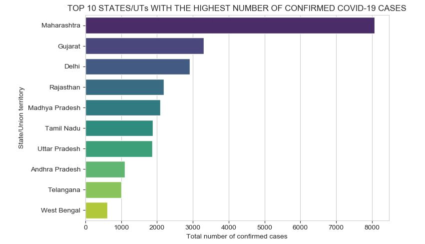
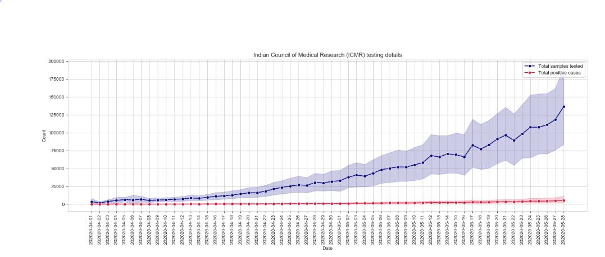

# Covid19-Analysis-and-Visualization

## 📖 Project Overview
The **Covid19-Analysis-and-Visualization** project uses data analysis and visualization techniques to analyze the effects of the ongoing COVID-19 pandemic in India. This project focuses on creating visualizations to highlight important observations made during the analysis of COVID-19 data.


The project includes various analyses and visualizations, such as the cumulative number of cases, total positive cases in each age group, state-wise distribution, and other critical COVID-19 statistics in India.


---

## ✨ Features
- **Cumulative Cases Over Time**: Visualizes the cumulative number of COVID-19 cases grouped by date.
- **Age Group Analysis**: Displays the total positive cases in each age group.
- **State-wise Statistics**: Shows total cases in India and its states and union territories.
- **Non-Cumulative Cases Over Time**: Represents non-cumulative number of cases grouped by date.
- **Cases Per Million**: Visualizes total cases per million people for India and each state/UT.
- **Age Distribution**: Presents the age distribution of positive cases.
- **National Descriptive Statistics**: Displays descriptive statistics for the ages of all positive cases in India.
- **Correlation Analysis**: Analyzes the correlation between population density and total positive cases.
- **Public Health Facilities**: Provides details on public health facilities in India.
- **ICMR Testing Data**: Includes Indian Council of Medical Research (ICMR) testing details.
- **State/UT Statistics**: Shows states and union territories with the highest and lowest number of confirmed COVID-19 cases.

---

## 🛠️ Technologies Used
- **Programming Language**: Python  
- **Libraries/Frameworks**:
  - Pandas
  - Matplotlib
  - Seaborn
  - Plotly
  - NumPy
- **Tools**:
  - Jupyter Notebooks for analysis and visualization
  - Python libraries: `pandas`, `numpy`, `matplotlib`, `seaborn`, `plotly`, etc.

---

## 📂 Project Structure

- `data/`: Dataset for COVID-19 cases and related statistics  
- `scripts/`: Python scripts for data processing and analysis  
- `notebooks/`: Jupyter Notebooks for analysis and visualizations  
- `requirements.txt`: List of dependencies  
- `README.md`: Project documentation  
- `LICENSE`: Project license  

---

## 🚀 How to Run the Project
- 1. Clone the repository:
    ```bash
    git clone https://github.com/THIMOTHY732/Covid19-Analysis-and-Visualization.git
    ```
- 2. Navigate to the project directory:
    ```bash
    cd Covid19-Analysis-and-Visualization
    ```
- 3. Install dependencies:
    ```bash
    pip install -r requirements.txt
    ```
- 4. Run the Jupyter Notebook:
    ```bash
    jupyter notebook
    ```

## 🌟 Use Cases
- **Data Analysis for COVID-19**: Helping public health authorities understand the impact of COVID-19 in India.
- **State/UT-wise Comparison**: Visualizing differences in COVID-19 statistics across states and union territories.
- **Public Awareness**: Providing insights into COVID-19 statistics for better decision-making in healthcare.






## 🤝 Contributing
Contributions are welcome!
To contribute:
- 1. Fork the repository.
- 2. Create a new branch:
    ```bash
    git checkout -b feature-name
    ```
- 3. Make your changes and commit:
    ```bash
    git commit -m "Add your message here"
    ```
- 4. Push to the branch:
    ```bash
    git push origin feature-name
    ```
- 5. Open a pull request on GitHub.

## 🙌 Acknowledgments
- The creators of Python and its libraries.
- The developers of Matplotlib, Seaborn, and Plotly for their excellent visualization tools.
- The dataset providers for making COVID-19 data publicly available.

## 🧑‍💻 Author
K.Thimothi,  
Connect with me on GitHub for more projects.
